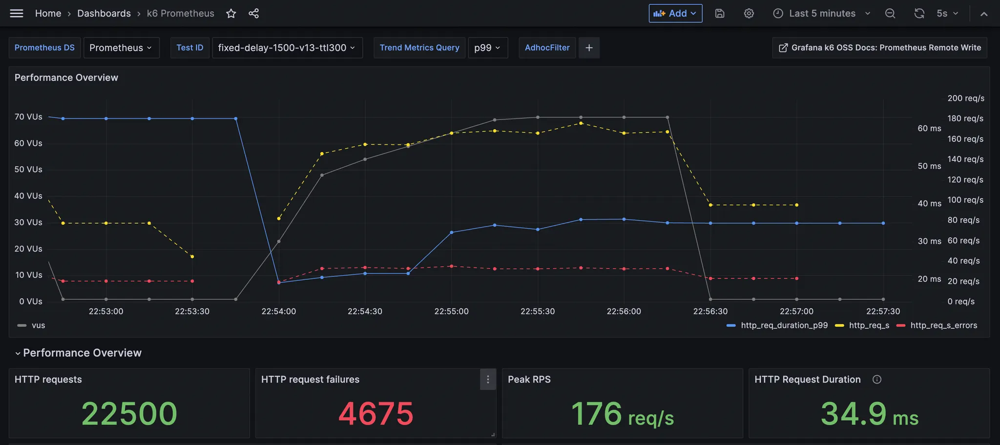
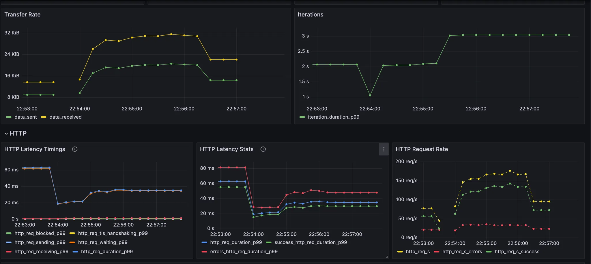

# Redis를 이용한 대기열 좌석 예약 시스템

## 1. 프로젝트 소개
Spring Boot와 Redis(Sorted Set)를 이용하여 높은 동시성 환경의 **선착순 좌석 예매 시스템**을 구현한 프로젝트입니다.
좌석 수보다 훨씬 많은 사용자가 동시에 접근하는 상황을 가정하여,
- 대기열 처리 방식
- 동시성 제어 전략
<br/>

을 검증하는 것을 목표로 했습니다.

## 2. 주요 기능
-   **공정 대기열**: Redis Sorted Set 을 활용한 선입선출(FIFO) 대기열
-   **원자적 처리**: Lua Scrip t를 통한 동시성 제어 및 데이터 정합성 보장
-   **실시간 시뮬레이터**: 웹 UI(`index.html`)를 통한 대기열 동작 시각화


## 3. 사용 기술 
-   **Backend**: Java 17, Spring Boot
-   **Database**: PostgreSQL, Redis
-   **Build**: Gradle
-   **Test**: k6
-   **Infrastructure**: Docker, Docker Compose
-   **Monitoring**: Prometheus, Grafana, cAdvisor

## 4. 시스템 아키텍처 개요


**설계 포인트**
- Redis를 Single Source of Truth로 사용
- 데이터 정합성은 Redis Lua Script에서 보장
- 분산 락은 필요한 지점에만 제한적으로 사용

## 5. 시작하기
### 요구 사항
-   Docker Desktop
-   Java 17 JDK

### 설정 및 실행
1.  **`.env` 파일 생성**: `cp .env.example .env` (필요시 내부 포트 등 수정)
2.  **시스템 실행**: `docker-compose up -d --build`
3.  **Grafana 확인**: `http://localhost:3000`

## 6. API 명세
모든 요청 시, 사용자를 식별하기 위해 `X-USER-ID` 헤더가 필요합니다.

-   `POST /seats/{seatId}/queue`
    -   **설명**: 특정 좌석에 대한 예약 대기열에 참여합니다.
    -   **성공 응답**: `200 OK`와 함께 현재 대기 순번(e.g., `5`)을 반환합니다.

-   `GET /seats/{seatId}/queue/status`
    -   **설명**: 대기열에서의 현재 상태(대기 순번, 총 대기자 수)를 확인합니다.

-   `GET /seats/{seatId}/hold/status`
    -   **설명**: 좌석을 임시 선점(HOLD)했는지와 남은 유효 시간을 확인합니다.

-   `POST /seats/{seatId}/reserve`
    -   **설명**: 임시 선점한 좌석의 예약을 최종 확정합니다. HOLD 상태일 때만 성공합니다.
    -   **성공 응답**: `200 OK`

## 7. 성능 테스트 및 결과 분석

본 프로젝트에서는 여러 단위 테스트를 진행했으며,
그중 **점진적 통합 부하 테스트 시나리오**를 대표 결과로 정리했습니다.


### 테스트 환경 및 실행
-   **도구**: k6, Prometheus, Grafana
-   **부하 테스트 실행**: `docker-compose run k6`

### 테스트 시나리오

- 좌석 1개에 대해 대기열 입장 → 상태 polling → 좌석 선점까지의 전체 흐름을 테스트
- 입장 만료 시간(TTL): 300초
- 상태 확인 요청은 1초 주기로 polling
- 요청 트래픽은 2개의 Spring 서버로 분산

```javascript
export const options = {
  stages: [
    { duration: '30s', target: 50 },
    { duration: '60s', target: 70 },
    { duration: '60s', target: 70 },
  ]
};
```

### 테스트 결과

- 총 **22,500건**의 요청 처리
- **4,675건**의 실패 응답 발생 (의도된 실패)
- 전체 요청 중 **정확히 1명만 좌석 선점 성공**
- 평균 응답 시간 및 p95 지연 시간은 모두 안정적인 수준 유지
- 로컬 환경 기준으로 타임아웃 및 시스템 다운 없음



## 8. 트러블슈팅

### 1. Polling 폭주로 인한 예약 실패

- 초기 polling 주기: **0.3초**
- 결과:
    - 요청 수 폭증 (40,000+)
    - 좌석 예약 요청이 TTL 내 처리되지 못함
- TTL을 300초 → 3600초로 늘려도 문제 지속

**원인**

- 문제는 TTL이 아니라 **과도한 polling 요청**

**해결**

- polling 주기를 **1초로 조정**
- 전체 요청 수 감소
- 좌석 예약 정상 성공 확인


---

### 2. 스케줄러 중복 실행 이슈 (분산 환경)

Spring 서버를 2대로 구성하자

각 인스턴스에서 `@Scheduled` 작업이 동시에 실행되는 문제가 발생했습니다.

- 이로 인해 스케줄러가 의도보다 빠르게 동작
- Redis에 불필요한 부하 발생

다만,

- **핵심 데이터 정합성은 Redis Lua Script로 이미 보장**되고 있었기 때문에 중복 실행으로 인한 데이터 오류는 발생하지 않았습니다.

**개선**

- 스케줄러 시작 시점에 한해 **Redisson 분산 락 적용**
- 동일 시점에 하나의 인스턴스만 스케줄링 로직 수행
